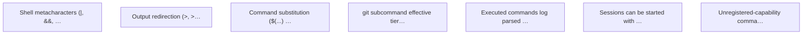

# Targets

## Active

### 🎯T17 Shell metacharacters (|, &&, ||, ;, &, (, )) are tokenized and routed through the policy engine
- **Value**: 20
- **Cost**: 8
- **Acceptance**:
  - dry_run of 'ls && rm -rf /' denies or decomposes into ls + rm segments
  - dry_run of 'ls; rm -rf /tmp/x' parses both segments and applies rm rules
  - dry_run of 'cat foo | tee bar' parses as read → write pipeline
  - Existing Unicode operator tests (¦, ＆＆, ‖, ；) still pass
  - A test suite exercising the bypasses listed in the context block exists and passes
- **Context**: Root cause: engine/engine.go:1043 and mcptools/mcptools.go:438 use strings.Fields to tokenize the raw command string. The parser (internal/pipeline/parser.go) only recognizes Unicode operators (¦ ＆＆ ‖ ； ‹ ›), never ASCII shell operators (| && || ; < >). Commands are then executed via sh -c (engine.go:1158), which DOES interpret ASCII operators. Result: anything after &&/;/|/ is executed but invisible to the policy engine. Concretely: `ls && rm -rf /` is allowed as L1 read-only because only `ls` is seen; `ls bin 2>/dev/null; echo x` executed successfully with both sides running. This is a complete L1 bypass for any command whose first segment is read-tier. Fix options: (a) replace strings.Fields with a shell-aware lexer like mvdan.cc/sh that emits tokens for shell operators, mapped to the existing Unicode tokens, or (b) teach Parse/ParseCommand to recognize ASCII operators directly. Option (a) is safer — it also catches quoting edge cases.
- **Tags**: security, parser, critical
- **Origin**: discovered during doit experimentation session 2026-04-11
- **Status**: Identified
- **Discovered**: 2026-04-11

### 🎯T18 Output redirection (&gt;, &gt;&gt;, &amp;&gt;) is recognized as a write operation
- **Value**: 13
- **Cost**: 3
- **Acceptance**:
  - dry_run of 'cat /etc/passwd > /tmp/stolen' requires TierWrite
  - dry_run of 'ls >> log.txt' requires TierWrite
  - dry_run of 'cmd &> log' requires TierWrite
  - A test case covers each redirect form
- **Context**: Currently `cat /etc/passwd > /tmp/stolen` is allowed as L1 read-only. Root cause: the parser looks for Unicode ‹ / › (U+2039/U+203A), not ASCII < / >. strings.Fields preserves > as a standalone token but parseSegment never checks it — it becomes a plain arg to `cat`. The Validate() function already correctly requires TierWrite when Pipeline.RedirectOut is set (parser.go:161-165), so the fix is purely at the tokenization layer: recognize >, >>, &>, <, << as redirect operators and populate RedirectIn/RedirectOut. Blocked by / closely related to the shell-metacharacter target.
- **Tags**: security, parser, critical
- **Origin**: discovered during doit experimentation session 2026-04-11
- **Status**: Identified
- **Discovered**: 2026-04-11

### 🎯T19 Command substitution ($(...) and backticks) is rejected or parsed recursively
- **Value**: 13
- **Cost**: 5
- **Acceptance**:
  - dry_run of 'ls $(rm -rf /)' is denied or the rm segment is seen and denied
  - dry_run of 'ls `rm -rf /`' is denied or the rm segment is seen and denied
  - Quoted substitutions inside strings are handled correctly
  - Variable expansion in argument positions ($PWD, ${HOME}) remains allowed
- **Context**: Currently `ls $(rm -rf /)` and `ls \`rm -rf /\`` are allowed at L1 — the substitution body is never parsed, and sh -c then expands it at runtime. This is a command-injection vector any time an allow-listed read command is the outer wrapper. Simplest safe fix: reject any command containing $(, ${, or backticks unless specifically opted in (e.g., by a Starlark rule that recognizes a safe pattern). Stronger fix: recursively parse substitution bodies as nested pipelines so rm inside $(...) is actually evaluated. Recommend the reject-by-default path first; expand later.
- **Tags**: security, parser, critical
- **Origin**: discovered during doit experimentation session 2026-04-11
- **Status**: Identified
- **Discovered**: 2026-04-11

### 🎯T20 git subcommand effective tier is enforced at policy evaluation time, not just at Run()
- **Value**: 13
- **Cost**: 3
- **Acceptance**:
  - dry_run of 'git commit -m x' reports tier write (not read)
  - dry_run of 'git push' reports tier dangerous
  - dry_run of 'git status' still reports tier read
  - gitSubcommandTier() is referenced from the pipeline Validate/evaluate path, not only Git.Run()
  - A test covers tier per subcommand via the engine, not via the capability's Run method directly
- **Context**: gitSubcommandTier() in internal/cap/builtin/git.go:41-56 correctly maps commit→write, push→dangerous, unknown→dangerous. But it's only called from Git.Run() (line 32), which is DEAD CODE under the MCP-first architecture — execution goes through engine.runShellCommand() via sh -c, not through capability.Run(). The policy evaluation path uses c.Tier() (parser.go:171, engine.go:1086) which returns the base TierRead for git. Result: `git commit -m test` and `git push` are allowed as L1 read-only. Fix: add an EffectiveTier(args []string) cap.Tier method to the Capability interface (with a default that returns Tier()), let Git override it to return gitSubcommandTier(args[0]), and have Validate + evaluatePolicy use the effective tier. Go will similarly benefit — `go test` vs `go install` should have different tiers.
- **Tags**: security, capabilities, critical
- **Origin**: discovered during doit experimentation session 2026-04-11
- **Status**: Identified
- **Discovered**: 2026-04-11

### 🎯T21 Executed commands log parsed segments and tiers to the audit log
- **Value**: 5
- **Cost**: 2
- **Acceptance**:
  - A doit_execute of 'cat foo | wc -l' produces an audit entry with segments=[cat,wc] and tiers=[read,read]
  - A doit_execute of 'git status' produces segments=[git]
  - Existing dry-run audit entries remain unchanged
- **Context**: In the audit log, dry_run entries populate segments and tiers, but execute entries (e.g. seq 46-47 from the experimentation session) have segments: null, tiers: null. Root cause: runShellCommand (engine.go:1152) calls logExecution with nil segments/tiers (line 1188). evaluatePolicy already computes segments and tiers — they should be threaded through to logExecution so execute entries match dry_run entries for forensic analysis.
- **Tags**: audit, observability
- **Origin**: discovered during doit experimentation session 2026-04-11
- **Status**: Identified
- **Discovered**: 2026-04-11

### 🎯T22 Sessions can be started with L1/L2-only configurations
- **Value**: 3
- **Cost**: 2
- **Acceptance**:
  - doit_session_start succeeds when L3 is disabled
  - Sessions group audit-log entries by session ID regardless of L3 status
  - L3-specific session features (context accumulation) degrade gracefully when L3 is off, without blocking the session itself
- **Context**: Currently doit_session_start returns `L3 policy engine not available; sessions require L3`. Sessions have value beyond L3 context accumulation — they scope audit entries, give intent/description to a group of commands, and provide a natural unit for retrospective review. Decoupling session lifecycle from L3 availability lets users run doit with L1/L2 only and still get session-structured audit history.
- **Tags**: sessions, ux
- **Origin**: discovered during doit experimentation session 2026-04-11
- **Status**: Identified
- **Discovered**: 2026-04-11

### 🎯T23 Unregistered-capability commands return an actionable error, not 'parse failed'
- **Value**: 3
- **Cost**: 1
- **Acceptance**:
  - dry_run of 'echo hello' returns a clear 'unknown capability: echo' message, not 'Level 0: no policy engine configured or parse failed'
  - Decision is deny (not escalate) when the capability is unknown and L3 is off
  - A test case exercises each unregistered-capability path
- **Context**: dry_run of plain `echo hello` or `curl https://example.com` returns `Decision: escalate (Level 0) Reason: no policy engine configured or parse failed`. The real cause is `reg.Lookup(name)` failing for unregistered capabilities in parseSegment (parser.go:82). Engine.evaluatePolicy (engine.go:1073) turns a parser error into `nil, nil, nil`, which downstream is rendered as Level 0 parse failed — misleading. The message should name the missing capability and suggest either registering it or writing a Starlark rule, and the decision should be deny (not escalate) when no L3 is available.
- **Tags**: ux, error-messages
- **Origin**: discovered during doit experimentation session 2026-04-11
- **Status**: Identified
- **Discovered**: 2026-04-11

## Achieved

### 🎯T10 L3→L2 auto-promotion detects stable patterns from decision history
- **Value**: 3
- **Cost**: 3
- **Acceptance**:
  - Semantic similarity grouping clusters similar L3 decisions (e.g., go test ./... variants)
  - Conditional branching detection identifies same command approved/denied based on different flags
  - Stable L3 patterns are proposed as L2 entries for human approval via elicitation
  - Auto-promotion runs after L3 decisions (tryPromote already exists, needs elicitation integration)
- **Context**: The claudia session (🎯T8) can analyse L3 decision history for patterns. Instead of simple audit log analysis, the agent uses semantic understanding to cluster similar decisions and propose L2 entries. Runs as a periodic task within the existing claudia session.
- **Tags**: policy, claudia
- **Origin**: roadmap — docs/todo.md Policy Migration
- **Status**: Achieved
- **Discovered**: 2026-04-10
- **Achieved**: 2026-04-11

### 🎯T11 Spaced repetition review keeps learned policy fresh
- **Value**: 3
- **Cost**: 2
- **Acceptance**:
  - L2 entries have ReviewSchedule with next_review dates
  - Overdue entries are surfaced via doit_policy_status or a dedicated review tool
  - Review elicitation presents the entry and asks: keep, modify, or remove
  - Review intervals use spaced repetition (increasing intervals after each confirmation)
- **Context**: L2 entries have ReviewSchedule fields but review is never triggered. Without periodic review, learned policy accumulates stale entries that don't reflect current project reality. Design doc section: Spaced Repetition Review.
- **Tags**: policy
- **Origin**: roadmap — design doc
- **Status**: Achieved
- **Discovered**: 2026-04-10
- **Achieved**: 2026-04-11

### 🎯T12 Gatekeeper self-audit detects dangerous rule combinations and drift
- **Value**: 2
- **Cost**: 3
- **Acceptance**:
  - Periodic audit detects rules that are dangerous in combination
  - Flags rules that have drifted from current project reality
  - Identifies L3 patterns that should have been promoted but weren't
  - Surfaces inconsistencies between L1 Starlark rules and L2 learned entries
- **Context**: The claudia session (🎯T8) can perform holistic rule set review. The agent reads all L1 Starlark rules and L2 entries, reasons about interactions, and flags dangerous combinations or drift. Runs as a periodic or on-demand task.
- **Tags**: policy, safety, claudia
- **Origin**: roadmap — docs/todo.md Gatekeeper Self-Audit
- **Status**: Achieved
- **Discovered**: 2026-04-10
- **Achieved**: 2026-04-11

### 🎯T13 Project context auto-discovery informs policy decisions
- **Value**: 3
- **Cost**: 2
- **Acceptance**:
  - Engine discovers project type from Makefile, go.mod, package.json, etc.
  - Project context influences L1/L2 evaluation (e.g., Go project allows go test)
  - CLAUDE.md is parsed for doit-relevant configuration hints
  - Context is passed to L3 for informed reasoning about command safety
- **Context**: Currently doit treats all commands the same regardless of project context. A Go project should auto-allow go test, a Node project should allow npm test. Per-project config handles explicit rules but auto-discovery handles the common case. Design doc section: Global vs Repo-Level Policy.
- **Tags**: policy, context
- **Origin**: roadmap — docs/todo.md Global vs Repo-Level Policy
- **Status**: Achieved
- **Discovered**: 2026-04-10
- **Achieved**: 2026-04-11

### 🎯T14 Session-scoped gatekeeper uses claudia for context-aware triage
- **Value**: 5
- **Cost**: 3
- **Acceptance**:
  - Worker can introduce a work session via doit_execute metadata (scope, description)
  - Session context persists across evaluations within a declared work session (no /clear)
  - Session agent makes faster, more informed decisions using accumulated work context
  - Session agent can pre-approve patterns within the declared scope
  - Session ends on worker signal or timeout, resuming per-command /clear behavior
- **Context**: With L3 already running as a persistent claudia session (🎯T8), the session agent becomes an extension: workers can introduce a work session with scope/description, and the existing claudia session accumulates that context across evaluations (skip /clear for within-session commands). This builds on top of the L3 claudia integration rather than being a separate system.
- **Tags**: policy, agent, claudia
- **Origin**: roadmap — docs/todo.md Gatekeeper Capabilities
- **Status**: Achieved
- **Discovered**: 2026-04-10
- **Achieved**: 2026-04-11

### 🎯T15 Gatekeeper has read-only repo access for claim verification
- **Value**: 2
- **Cost**: 2
- **Acceptance**:
  - Gatekeeper can read .gitignore to verify 'generated directory' claims
  - Gatekeeper can read build config to verify build-related command justifications
  - Read-only access is enforced — gatekeeper cannot modify the repo
  - Hardcoded allowlist governs which files the gatekeeper can read
- **Context**: When an agent claims 'this directory is generated, safe to delete', the gatekeeper currently takes it at face value. With repo access, it can verify claims against .gitignore, build configs, etc.
- **Tags**: policy, safety
- **Origin**: roadmap — docs/todo.md Gatekeeper Capabilities
- **Status**: Achieved
- **Discovered**: 2026-04-10
- **Achieved**: 2026-04-11

### 🎯T16 doit is the sole execution path — agents have no direct Bash access
- **Value**: 8
- **Cost**: 2
- **Acceptance**:
  - Documentation and agents-guide instruct agents to use only doit_execute
  - Claude Code permission config denies Bash and routes through doit MCP tools
  - Worker CLAUDE.md audit tool verifies doit routing is configured correctly
  - Agents that attempt direct Bash are detected and flagged
- **Context**: The entire security model depends on doit being the sole execution path. If an agent can bypass doit via direct Bash, all policy enforcement is theatre. This is about ensuring the deployment configuration enforces the architecture.
- **Tags**: safety, deployment
- **Origin**: roadmap — design doc core principle
- **Status**: Achieved
- **Discovered**: 2026-04-10
- **Achieved**: 2026-04-11

### 🎯T8 L3 evaluation runs as a persistent claudia session
- **Value**: 5
- **Cost**: 3
- **Acceptance**:
  - doit imports claudia as a Go library dependency
  - Engine.New starts a persistent claudia session when L3 is enabled
  - L3 evaluation sends a structured prompt to the claudia session and parses the response
  - Session /clear runs between evaluations to prevent context cross-contamination
  - L3 escalation fires MCP elicitation with the agent's reasoning
  - L3 decisions are recorded in audit log with level=3
  - Session is gracefully shut down when the engine stops
- **Context**: Instead of a raw LLM API client, L3 uses a persistent claudia session (github.com/marcelocantos/claudia). The session starts with the engine and persists for its lifetime. Each evaluation sends a prompt, gets a decision, then /clear resets context. This gives L3 full Claude Code capabilities (file reading, project context) while maintaining clean evaluation boundaries. Collapses the old L3-as-API-call and session-agent concepts into one architecture.
- **Tags**: policy, llm, claudia
- **Origin**: roadmap — STABILITY.md 1.0 gap
- **Status**: Achieved
- **Discovered**: 2026-04-10
- **Achieved**: 2026-04-11

### 🎯T9 Rule promotion generates high-quality Starlark from L3 context
- **Value**: 3
- **Cost**: 3
- **Acceptance**:
  - Phase 2 elicitation rule proposals include L3 reasoning context
  - Generated Starlark rules handle edge cases (combined flags, flag=value syntax)
  - Generated rules include comprehensive test cases covering allow and deny paths
  - ProposeRules uses command semantics (not just string splitting) to determine generality levels
- **Context**: With L3 running as a claudia session, rule promotion can leverage the agent's full reasoning capability. Instead of simple string splitting, the claudia session generates Starlark rules with semantic understanding of the command, its flags, and the project context. The agent proposes rules at varying generality levels for the phase 2 elicitation.
- **Tags**: policy, starlark, claudia
- **Origin**: roadmap — STABILITY.md 1.0 gap
- **Status**: Achieved
- **Discovered**: 2026-04-10
- **Achieved**: 2026-04-11

### 🎯T7 L2 policy store has an MCP management tool
- **Value**: 5
- **Cost**: 2
- **Acceptance**:
  - doit_policy_list MCP tool shows L2 entries with match criteria, decision, provenance, and review status
  - doit_policy_delete MCP tool removes an L2 entry by ID
  - doit_policy_status reports L2 entry count
- **Context**: Users cannot currently inspect or manage L2 learned policy entries. The only way to see what's been learned is to read the YAML file directly. This is a 1.0 prerequisite (STABILITY.md gap).
- **Tags**: policy, mcp
- **Origin**: roadmap — STABILITY.md 1.0 gap
- **Status**: Achieved
- **Discovered**: 2026-04-10
- **Achieved**: 2026-04-10

### 🎯T1 MCP-first architecture
- **Value**: 5
- **Cost**: 1
- **Acceptance**: TODO
- **Status**: Achieved
- **Discovered**: 2026-04-09

### 🎯T2 sh -c execution model
- **Value**: 4
- **Cost**: 1
- **Acceptance**: TODO
- **Status**: Achieved
- **Discovered**: 2026-04-09

### 🎯T3 Starlark L1 rules
- **Value**: 3
- **Cost**: 2
- **Acceptance**: TODO
- **Status**: Achieved
- **Discovered**: 2026-04-09

### 🎯T4 Per-project policy
- **Value**: 2
- **Cost**: 1
- **Acceptance**: TODO
- **Status**: Achieved
- **Discovered**: 2026-04-09

### 🎯T5 Test coverage for core packages
- **Value**: 3
- **Cost**: 1
- **Acceptance**: TODO
- **Status**: Achieved
- **Discovered**: 2026-04-09

### 🎯T6 Clean up legacy code paths
- **Value**: 1
- **Cost**: 1
- **Acceptance**: TODO
- **Status**: Achieved
- **Discovered**: 2026-04-09

## Graph

