# Targets

## Active

### 🎯T10 L3→L2 auto-promotion detects stable patterns from decision history
- **Value**: 3
- **Cost**: 3
- **Acceptance**:
  - Semantic similarity grouping clusters similar L3 decisions (e.g., go test ./... variants)
  - Conditional branching detection identifies same command approved/denied based on different flags
  - Stable L3 patterns are proposed as L2 entries for human approval via elicitation
  - Auto-promotion runs after L3 decisions (tryPromote already exists, needs elicitation integration)
- **Context**: The tryPromote mechanism exists but uses audit log analysis without semantic understanding. Needs to detect patterns like 'go test with any args is always allowed' and propose them as L2 entries.
- **Tags**: policy
- **Origin**: roadmap — docs/todo.md Policy Migration
- **Status**: Identified
- **Discovered**: 2026-04-10

### 🎯T11 Spaced repetition review keeps learned policy fresh
- **Value**: 3
- **Cost**: 2
- **Acceptance**:
  - L2 entries have ReviewSchedule with next_review dates
  - Overdue entries are surfaced via doit_policy_status or a dedicated review tool
  - Review elicitation presents the entry and asks: keep, modify, or remove
  - Review intervals use spaced repetition (increasing intervals after each confirmation)
- **Context**: L2 entries have ReviewSchedule fields but review is never triggered. Without periodic review, learned policy accumulates stale entries that don't reflect current project reality. Design doc section: Spaced Repetition Review.
- **Tags**: policy
- **Origin**: roadmap — design doc
- **Status**: Identified
- **Discovered**: 2026-04-10

### 🎯T12 Gatekeeper self-audit detects dangerous rule combinations and drift
- **Value**: 2
- **Cost**: 3
- **Acceptance**:
  - Periodic audit detects rules that are dangerous in combination
  - Flags rules that have drifted from current project reality
  - Identifies L3 patterns that should have been promoted but weren't
  - Surfaces inconsistencies between L1 Starlark rules and L2 learned entries
- **Context**: As the rule set grows through L3→L1 promotion, there's no mechanism to check that the accumulated rules still make sense together. A self-audit catches the combinatorial risks that individual rule reviews miss.
- **Tags**: policy, safety
- **Origin**: roadmap — docs/todo.md Gatekeeper Self-Audit
- **Status**: Identified
- **Discovered**: 2026-04-10

### 🎯T13 Project context auto-discovery informs policy decisions
- **Value**: 3
- **Cost**: 2
- **Acceptance**:
  - Engine discovers project type from Makefile, go.mod, package.json, etc.
  - Project context influences L1/L2 evaluation (e.g., Go project allows go test)
  - CLAUDE.md is parsed for doit-relevant configuration hints
  - Context is passed to L3 for informed reasoning about command safety
- **Context**: Currently doit treats all commands the same regardless of project context. A Go project should auto-allow go test, a Node project should allow npm test. Per-project config handles explicit rules but auto-discovery handles the common case. Design doc section: Global vs Repo-Level Policy.
- **Tags**: policy, context
- **Origin**: roadmap — docs/todo.md Global vs Repo-Level Policy
- **Status**: Identified
- **Discovered**: 2026-04-10

### 🎯T14 Session-scoped gatekeeper agent triages requests with work context
- **Value**: 5
- **Cost**: 5
- **Acceptance**:
  - Worker can introduce a work session with description and scope
  - doit spawns a context-aware evaluation agent for that session
  - Session agent makes faster, more informed L3 decisions using work context
  - Session agent can pre-approve patterns within the declared scope
  - Session ends when worker signals completion or timeout
- **Context**: The most ambitious design doc idea. Instead of evaluating each command in isolation, a session-scoped agent understands what the worker is trying to accomplish and can make better allow/deny decisions. Reduces escalation noise for legitimate work while catching out-of-scope operations.
- **Tags**: policy, agent
- **Origin**: roadmap — docs/todo.md Gatekeeper Capabilities
- **Status**: Identified
- **Discovered**: 2026-04-10

### 🎯T15 Gatekeeper has read-only repo access for claim verification
- **Value**: 2
- **Cost**: 2
- **Acceptance**:
  - Gatekeeper can read .gitignore to verify 'generated directory' claims
  - Gatekeeper can read build config to verify build-related command justifications
  - Read-only access is enforced — gatekeeper cannot modify the repo
  - Hardcoded allowlist governs which files the gatekeeper can read
- **Context**: When an agent claims 'this directory is generated, safe to delete', the gatekeeper currently takes it at face value. With repo access, it can verify claims against .gitignore, build configs, etc.
- **Tags**: policy, safety
- **Origin**: roadmap — docs/todo.md Gatekeeper Capabilities
- **Status**: Identified
- **Discovered**: 2026-04-10

### 🎯T16 doit is the sole execution path — agents have no direct Bash access
- **Value**: 8
- **Cost**: 2
- **Acceptance**:
  - Documentation and agents-guide instruct agents to use only doit_execute
  - Claude Code permission config denies Bash and routes through doit MCP tools
  - Worker CLAUDE.md audit tool verifies doit routing is configured correctly
  - Agents that attempt direct Bash are detected and flagged
- **Context**: The entire security model depends on doit being the sole execution path. If an agent can bypass doit via direct Bash, all policy enforcement is theatre. This is about ensuring the deployment configuration enforces the architecture.
- **Tags**: safety, deployment
- **Origin**: roadmap — design doc core principle
- **Status**: Identified
- **Discovered**: 2026-04-10

### 🎯T7 L2 policy store has an MCP management tool
- **Value**: 5
- **Cost**: 2
- **Acceptance**:
  - doit_policy_list MCP tool shows L2 entries with match criteria, decision, provenance, and review status
  - doit_policy_delete MCP tool removes an L2 entry by ID
  - doit_policy_status reports L2 entry count
- **Context**: Users cannot currently inspect or manage L2 learned policy entries. The only way to see what's been learned is to read the YAML file directly. This is a 1.0 prerequisite (STABILITY.md gap).
- **Tags**: policy, mcp
- **Origin**: roadmap — STABILITY.md 1.0 gap
- **Status**: Identified
- **Discovered**: 2026-04-10

### 🎯T8 L3 LLM evaluation works end-to-end with elicitation
- **Value**: 5
- **Cost**: 3
- **Acceptance**:
  - L3 enabled in config triggers LLM evaluation for commands that L1/L2 don't match
  - L3 escalation fires MCP elicitation with Allow once/always, Deny/always options
  - L3 deny includes LLM reasoning in the elicitation message
  - L3 decisions are recorded in audit log with level=3
- **Context**: L3 is wired up but never tested end-to-end with the new elicitation flow. The LLM client exists but the integration path through elicitation needs validation. STABILITY.md 1.0 gap.
- **Tags**: policy, llm
- **Origin**: roadmap — STABILITY.md 1.0 gap
- **Status**: Identified
- **Discovered**: 2026-04-10

### 🎯T9 Rule promotion generates high-quality Starlark from L3 context
- **Value**: 3
- **Cost**: 3
- **Acceptance**:
  - Phase 2 elicitation rule proposals include L3 reasoning context
  - Generated Starlark rules handle edge cases (combined flags, flag=value syntax)
  - Generated rules include comprehensive test cases covering allow and deny paths
  - ProposeRules uses command semantics (not just string splitting) to determine generality levels
- **Context**: Current ProposeRules uses simple string splitting on the command. L3 has richer context about why a command was allowed/denied. Using L3 to propose rules would produce better generalizations. STABILITY.md gap: elicitation phase 2 maturity.
- **Tags**: policy, starlark
- **Origin**: roadmap — STABILITY.md 1.0 gap
- **Status**: Identified
- **Discovered**: 2026-04-10

## Achieved

### 🎯T1 MCP-first architecture
- **Value**: 5
- **Cost**: 1
- **Acceptance**: TODO
- **Status**: Achieved
- **Discovered**: 2026-04-09

### 🎯T2 sh -c execution model
- **Value**: 4
- **Cost**: 1
- **Acceptance**: TODO
- **Status**: Achieved
- **Discovered**: 2026-04-09

### 🎯T3 Starlark L1 rules
- **Value**: 3
- **Cost**: 2
- **Acceptance**: TODO
- **Status**: Achieved
- **Discovered**: 2026-04-09

### 🎯T4 Per-project policy
- **Value**: 2
- **Cost**: 1
- **Acceptance**: TODO
- **Status**: Achieved
- **Discovered**: 2026-04-09

### 🎯T5 Test coverage for core packages
- **Value**: 3
- **Cost**: 1
- **Acceptance**: TODO
- **Status**: Achieved
- **Discovered**: 2026-04-09

### 🎯T6 Clean up legacy code paths
- **Value**: 1
- **Cost**: 1
- **Acceptance**: TODO
- **Status**: Achieved
- **Discovered**: 2026-04-09

## Graph

```mermaid
graph TD
    T10["L3→L2 auto-promotion detects …"]
    T11["Spaced repetition review keep…"]
    T12["Gatekeeper self-audit detects…"]
    T13["Project context auto-discover…"]
    T14["Session-scoped gatekeeper age…"]
    T15["Gatekeeper has read-only repo…"]
    T16["doit is the sole execution pa…"]
    T7["L2 policy store has an MCP ma…"]
    T8["L3 LLM evaluation works end-t…"]
    T9["Rule promotion generates high…"]
```

